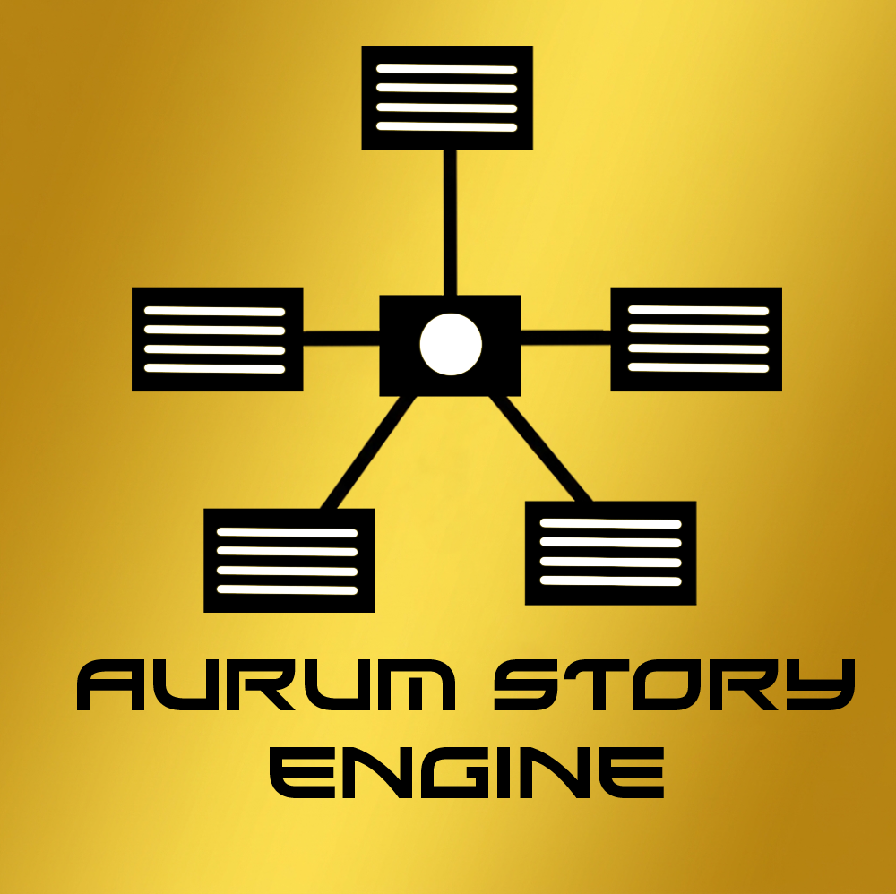

<div align="center">
  
  <h1>⚜️ Aurum Story Engine</h1>
  <p><i>O conhecimento narrativo não deve ser apenas armazenado. Deve ser compreendido.</i></p>
  <br/>
  
  
  
</div>

---

**Aurum Story Engine** é uma plataforma de worldbuilding baseada em grafos, desenvolvida para transformar histórias, lores e universos complexos em organismos vivos e navegáveis. Ela abandona a organização passiva por páginas e wikis e substitui por um **canvas interativo de nós e conexões**, onde cada elemento do universo narrativo é um objeto com identidade, relações e história.

---

## 📜 O Manifesto Aurum

Toda grande ferramenta nasce de uma filosofia. A Aurum é regida pelos seguintes princípios:

### 1. Relações são mais importantes que páginas
Uma wiki organiza documentos isolados. O Aurum organiza conexões. O valor real para um autor não está em registrar dados passivamente, mas em revelar como tudo no seu mundo se conecta.

### 2. Grafos antes de listas
Histórias são redes complexas — genealogias, cronologias, influências, conflitos. Toda informação narrativa pode ser representada como um **grafo vivo**.

### 3. Uma única fonte da verdade
Cada informação deve possuir uma origem clara. A duplicação cria inconsistências. Na Aurum, uma alteração em um nó propaga por todas as relações existentes.

### 4. Todo universo merece uma memória
Projetos crescem. Anos passam. Detalhes vitais se perdem. O Aurum preserva de forma imutável a memória de um universo criativo. A continuidade de uma história deixa de depender da memória humana.

### 5. A IA como copiloto, não como autor
A inteligência artificial na Aurum atua como navegador e bibliotecário: organiza o caos, sugere ligações, localiza inconsistências. A centelha criativa e a palavra final permanecem puramente humanas.

### 6. Escalável desde o primeiro personagem
A mesma estrutura serve para uma história curta, uma saga épica ou um universo compartilhado com milhares de eventos. Nenhum projeto deve precisar mudar de ferramenta porque cresceu.

### 7. Aberto à evolução contínua
A engine não impõe um modelo rígido. Ferramentas existem para remover atritos. Quanto menos tempo o autor gasta procurando informações perdidas, mais tempo tem para criar.

---

## 🎨 Estética e UX

O Aurum adota o padrão visual **33XL Dark + Aurum** — pensado para não distrair, mas impressionar:

- **Core Dark / Preto Absoluto** — foco total no conhecimento narrativo.
- **Dourado Futurista** — realces e brilhos em tons de ouro translúcido, representando o valor das ideias.
- **Glassmorphism** — painéis de vidro fosco que deslizam sem interromper o fluxo mental.
- **Neon contextual** — cada módulo possui uma cor neon exclusiva para diferenciação imediata.
- **Tipografia Xirod** — fonte futurística usada para os títulos da engine.

---

## 🧩 Módulos de Contexto

O canvas é organizado em **8 módulos de contexto**, cada um com sua paleta e iconografia exclusiva:

| Módulo | Cor | Tipos de Nó |
|---|---|---|
| 🌐 **MUNDO** | Verde Neon `#39FF14` | Local, Organização, Evento, Objeto, Artefato, Conceito, Lore |
| 👤 **ENTIDADES** | Ciano Neon `#00E5FF` | Personagem, Facção, Empresa, Clã, Família, Guilda, Governo, Ordem |
| 🕰️ **CRONOLOGIA** | Amarelo `#FFF000` | Era, Época, Marco Histórico |
| 📖 **NARRATIVA** | Vermelho `#FF0033` | Missão, Trama, Conflito |
| ✨ **PODERES** | Magenta `#D500FF` | Magia, Habilidade, Tecnologia |
| 🗺️ **GEOGRAFIA** | Laranja `#FF6600` | Território, Bioma |
| 🌙 **MITOLOGIA** | Azul Anil `#4D4DFF` | Divindade, Religião, Culto |
| ⚔️ **AÇÕES** | Rosa `#FF1493` | Estratégia, Estratagema, Sabotagem, Aliança, Atentado |

---

## 🃏 Tipos de Nó

### Nó Padrão (CustomNode)
Usado para entidades do tipo MUNDO, CRONOLOGIA, NARRATIVA, PODERES, GEOGRAFIA, MITOLOGIA e AÇÕES. Cada nó carrega:
- Ícone contextual dinâmico mapeado por `EntityConfig`
- Rótulo e tipo de entidade com cor neon do módulo
- Suporte a drag-and-drop a partir da sidebar
- Pontos de conexão (handles) em todos os lados
- Barra de ações: Pré-visualizar, Editar, Deletar

### Nó de Entidade — GenealogyNode
Usado exclusivamente pelo módulo **ENTIDADES**. Formato de "card de perfil":
- Foto de perfil ou ícone específico por tipo de entidade (ex: 💼 Empresa, 🛡️ Clã, 👪 Família...)
- Nome em destaque
- Badge de status: **Vivo** 🟢 / **Morto** 🔴 / **Desaparecido** 🟡 / **Exilado** 🟣
- Handles para conexões genealógicas e hierárquicas
- Suporte a drag-and-drop a partir da sidebar

---

## 🚀 Stack Tecnológico

| Camada | Tecnologia |
|---|---|
| Frontend | React 18 + TypeScript |
| Bundler | Vite |
| Canvas/Grafo | Engine de câmera personalizada (zoom + pan manual) |
| Ícones | `lucide-react` |
| IDs únicos | `uuid` |
| Persistência | `idb-keyval` (IndexedDB — 100% local, offline-first) |
| Estilo | Vanilla CSS + CSS Variables |

> **Nota:** O motor de grafos foi construído do zero, sem dependências externas de libs como `@xyflow/react`, garantindo controle total sobre renderização, interações e performance.

---

## 🛠️ Como Executar

```bash
# 1. Clone o repositório
git clone <url-do-repo>
cd aurum-story-engine

# 2. Instale as dependências
npm install

# 3. Rode o servidor de desenvolvimento
npm run dev
# Acesse: http://localhost:5173

# 4. Para gerar o build de produção
npm run build
```

---

## 📁 Estrutura do Projeto

```
src/
├── App.tsx            # Componente raiz: canvas, sidebar, menus de contexto
├── CustomNode.tsx     # Nó padrão + IconMap (mapeamento lucide → chave string)
├── GenealogyNode.tsx  # Nó de Entidade (card de perfil com status e ícone dinâmico)
├── types.ts           # Tipos globais + EntityConfig (label, cor e ícone por tipo)
├── index.css          # Sistema de design global (variáveis CSS, neon-btn, animações)
└── main.tsx           # Ponto de entrada React
```

---

## ⚖️ Licença

Licenciado sob **GPL-3.0**. Queremos que este organismo cresça livre e que suas melhorias sempre beneficiem a comunidade de autores e desenvolvedores. Veja o arquivo `LICENSE` para os detalhes completos.

---

<div align="center">
  <p><i>Grandes universos não nascem do acúmulo de páginas.<br/>Eles nascem da qualidade das conexões entre elas.</i></p>
  <br/>
  <b>⚜️ Aurum Story Engine</b>
</div>
